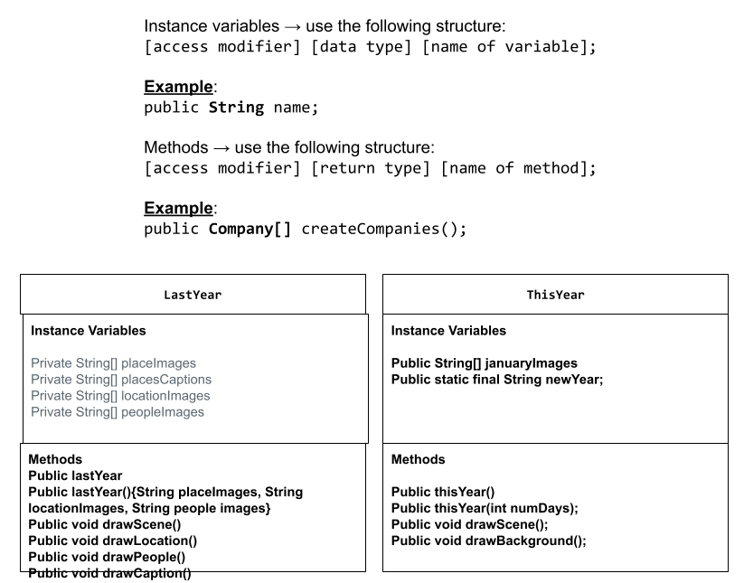

# Project: New Scene, New Me

## Introduction

Software engineers develop programs to create visual and audio experiences using object-oriented programming. As we begin 2026, your goal is to create an animation program that reflects on your experiences from 2025 and visualizes your goals and aspirations for the year ahead using the Theater and Scene API.

## Requirements

Use your knowledge of object-oriented programming, one-dimensional (1D) arrays, algorithms, and the Theater/Scene API to create your animation program:
- **Write Scene subclasses** – Create two Scene subclasses: one to visualize your 2025 recap (LastYear) and another to project your 2026 goals (ThisYear). Each class must include both a no-argument constructor and a parameterized constructor.
- **Use private instance variables** – Implement proper encapsulation by declaring instance variables as private in your Scene subclasses.
- **Create 1D arrays** – Create at least two 1D arrays to store data for your scenes. One array must be created using an initializer list, and one array must be populated by reading from a text file using the FileReader class.
- **Write a method** – Write a method that finds or manipulates the elements in a 1D array to provide the information your user needs.
- **Access and modify array elements** – Use algorithms to traverse, access, and/or modify elements in your 1D arrays to display personalized content in your scenes.
- **Use logic and iteration** – Incorporate selection statements (if/if-else) and loops (while, for, or enhanced for) to control the flow and display of content in your scenes.
Incorporate variety of media – Use at least four different types of Scene API methods across both scenes (examples: drawImage(), drawText(), drawRectangle(), drawEllipse(), playSound(), setTextStyle(), setFillColor(), etc.).
- **Create a UML diagram** – Design a UML class diagram showing your Scene subclasses with their instance variables, constructors, and methods before you begin coding.
- **Document your code** – Use multi-line comments to explain the purpose of each method (including preconditions and postconditions) and single-line comments to explain code segments.

## UML Diagram 

Put an image of your UML Diagram here. Upload the image of your UML Diagram to your repository, then use the Markdown syntax to insert your image here. Make sure your image file name is one work, otherwise it might not properly get displayed on this README. 

 

## Description of 2025 recap

Write a description of what you included in your 2025 recap scene (LastYear)
What I included in my 2025 recap was a bunch of picture I took with my friends over the year, my yearly spotfiy wrapped, and my favorite trip that year which was to disneyland. I added pictures of my friends to my recap since they helped make my year ten times better by supporting me and always making me laugh. My yearly spotify wrapped took a glimpse of my music taste, and how it rapidly changed over the year. Not only that but it shows people what I listened to throughout the year. Lastly I showed my favorite trip to Disneyland since it was my first time in 10 years and it truly was the most magical place on earth.

## Description of 2026 goals

Write a description of what you included in your 2026 goals scene (ThisYear)
I added a picture of a collage I made that included a bunch of goals I would like to focus on and words that can describe the better version of myself that I am trying to create this year. Words such as determined, focused, and peaceful come to mind when I think about the better version of me since the year of 2025 I was very stressed and lost focus at the end of the year and I dont want to quit when things get hard. The goals I included was finishing with a 4.0 once again and at least passing most of my AP exams. 

## Scene API Usage

Describe how you were able to use the various methods from the Scene API to create your animation. 
